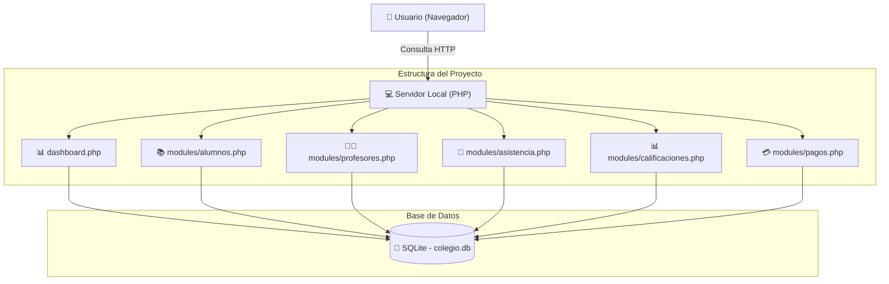
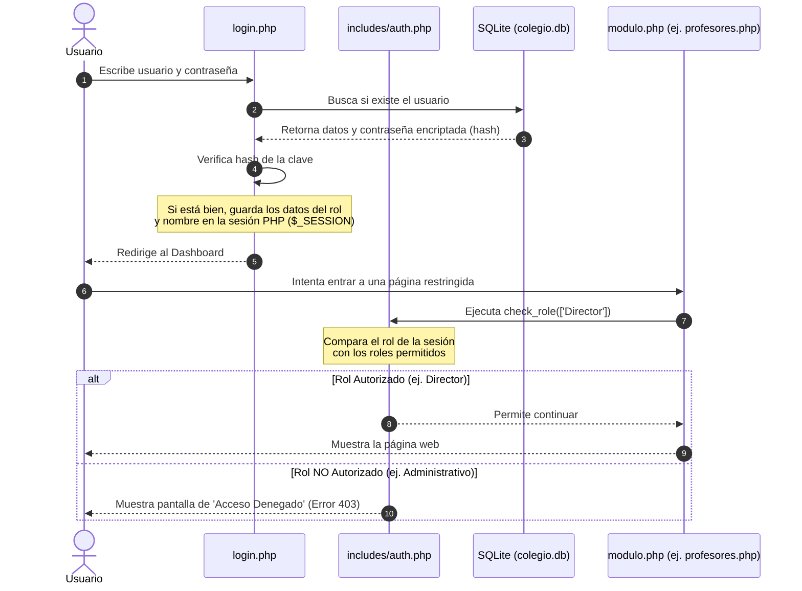
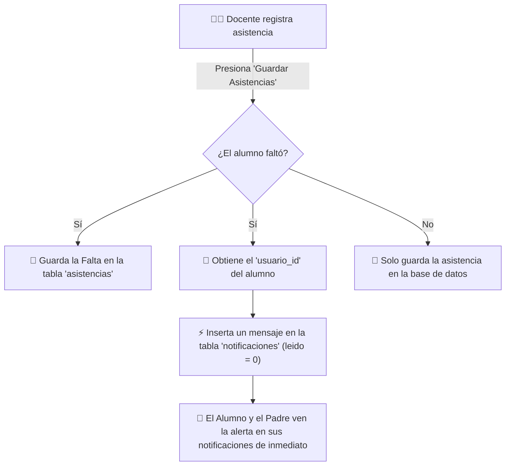

# 🎓 Sistema Académico Legacy - Colegio Futuro Digital

Este proyecto es el **Sistema Legacy (Monolítico)** del Colegio Futuro Digital. Lo desarrollamos usando **PHP, SQLite, HTML5, CSS3 y JavaScript** básico. 

En nuestro curso de **Arquitectura Orientada a Servicios (SOA)** en la **UTP**, estamos usando este sistema como la base monolítica inicial. El objetivo es entender cómo funciona el negocio del colegio, ver sus procesos actuales y a partir de aquí, planificar la **migración hacia microservicios** desacoplados.

---

## 🏛️ ¿Cómo funciona este Monolito?

El sistema está construido de forma monolítica tradicional:
*   **Base de datos compartida:** Todos los archivos PHP leen y escriben en el mismo archivo SQLite (`colegio.db`).
*   **Rutas directas:** No hay un enrutador web complejo. Cada página o acción del menú del sistema carga directamente un archivo `.php` físico (por ejemplo, para ver los alumnos se carga `/modules/alumnos.php`).
*   **Código acoplado:** Las vistas en HTML, la lógica de las consultas SQL y el estilo CSS están integrados dentro de los archivos de cada módulo, apoyándose en archivos comunes dentro de `includes/`.

---

## 👥 Control de Roles y Accesos del Sistema

Hemos configurado **5 roles** en el sistema para simular los accesos reales que tendría el colegio. Cada rol tiene permisos específicos en los archivos PHP:

| Rol | Módulos permitidos | ¿Qué puede hacer en el sistema? | Restricciones aplicadas |
| :--- | :--- | :--- | :--- |
| **👑 Director** | **Todos los módulos** | Ve el dashboard general con estadísticas y tiene control total (Crear, Editar y Eliminar) sobre Alumnos, Docentes, Cursos, Matrículas, Pagos y Notificaciones. | No tiene restricciones de seguridad. |
| **💼 Administrativo**<br>*(Administrador)* | Alumnos, Cursos, Matrículas, Pagos y Notificaciones. | Gestiona la parte administrativa: registra alumnos, actualiza cursos y maneja la recaudación de pensiones (marcar pagos). | **No puede gestionar Profesores** (módulo bloqueado). **Tampoco entra en la parte pedagógica** (Asistencia y Calificaciones están completamente bloqueados). |
| **👨‍🏫 Docente** | Alumnos (Solo ver), Cursos (Solo ver), Asistencia, Calificaciones y Notificaciones. | Pasa asistencia diaria y sube notas (escala de 0 a 20) **únicamente en los cursos que tiene asignados**. Puede revisar fichas de alumnos. | **No puede crear ni borrar registros importantes** (ni alumnos, ni cursos, ni profesores). No tiene acceso al módulo de pagos. |
| **🧑‍🎓 Alumno** | Asistencia, Calificaciones, Pagos y Notificaciones (Solo de su cuenta). | Entra para ver su libreta de notas, su porcentaje de asistencia, sus inasistencias y si tiene pensiones por pagar. Puede descargar reportes en PDF. | Perfil 100% de lectura. **No puede editar nada** y no puede ver datos de otros compañeros. |
| **👨‍👩‍👦 Padre** | Dashboard de su hijo, Asistencia, Calificaciones, Pagos y Notificaciones. | Tiene una vista de resumen para monitorear el promedio, las notas por curso, las faltas de su hijo(a) y el estado de cuenta de sus pensiones. | Perfil 100% de lectura. **No puede modificar nada** de la información académica o de pagos. |

---

## 📊 Diagramas de Flujo del Sistema (Mermaid)

### 1. Estructura General y Base de Datos
Aquí se ve cómo el servidor PHP procesa cada módulo por separado, pero todos terminan escribiendo en la misma base de datos SQLite centralizada:



### 2. Flujo de Login y Seguridad de Roles (`auth.php`)
Este diagrama explica cómo el sistema valida las credenciales y cómo la función `check_role()` rebota a los usuarios que no tienen permiso:



### 3. Flujo automático al registrar una Falta
Cuando un docente marca una inasistencia, el sistema de forma interna registra la falta y automáticamente le envía una notificación al estudiante y su apoderado:



---

## 📂 Organización de las Carpetas

```bash
SISTEMALEGACY/
│
├── assets/                  # CSS y scripts de diseño
│   ├── css/
│   │   └── style.css        # Estilos visuales del sistema (incluye el diseño responsive)
│   └── js/
│
├── config/                  # Archivos de conexión
│   └── db.php               # Crea la base de datos SQLite y mete datos de prueba automáticamente
│
├── database/                # Base de datos y mantenimiento
│   ├── colegio.db           # Archivo SQLite activo
│   ├── colegio.db.bak       # Copia de seguridad por si acaso
│   └── reset_db.php         # Script de consola para reiniciar la base de datos a cero
│
├── includes/                # Archivos PHP reutilizables
│   ├── auth.php             # Controla el login, las sesiones y los roles permitidos
│   ├── header.php           # Menú superior y estilos comunes
│   ├── footer.php           # Pie de página común
│   └── sidebar.php          # Barra de navegación lateral (cambia según el rol del usuario)
│
├── modules/                 # Archivos de cada módulo
│   ├── alumnos.php          # Ver alumnos y CRUD (crear/editar/borrar)
│   ├── asistencia.php       # Tomar y consultar asistencia
│   ├── calificaciones.php   # Subir notas e informes de calificaciones
│   ├── cursos.php           # Lista de cursos, horarios y profesores
│   ├── matriculas.php       # Matricular alumnos y cambiar estados
│   ├── notificaciones.php   # Bandeja de entrada y envío de avisos
│   ├── pagos.php            # Ver cobros, registrar deudas y pagos
│   └── profesores.php       # Ver docentes y CRUD
│
├── dashboard.php            # Página de inicio con estadísticas y gráficos (usando Chart.js)
├── index.php                # Redirige al login o al dashboard si ya estás logueado
├── login.php                # Pantalla de login (tiene botones para autocompletar cuentas demo)
├── logout.php               # Cierra la sesión del usuario
└── README.md                # Esta guía
```

---

## 💾 Tablas de la Base de Datos (SQLite)

Este es el script SQL con el que creamos las tablas en SQLite de forma relacional:

```sql
-- Tabla para guardar los usuarios y sus roles
CREATE TABLE usuarios (
    id INTEGER PRIMARY KEY AUTOINCREMENT,
    username TEXT UNIQUE NOT NULL,
    password TEXT NOT NULL,
    nombre TEXT NOT NULL,
    email TEXT,
    rol TEXT NOT NULL CHECK(rol IN ('Director', 'Administrador', 'Docente', 'Alumno', 'Padre de familia'))
);

-- Ficha de datos personales de los estudiantes
CREATE TABLE alumnos (
    id INTEGER PRIMARY KEY AUTOINCREMENT,
    usuario_id INTEGER UNIQUE,
    nombre TEXT NOT NULL,
    apellido TEXT NOT NULL,
    documento TEXT UNIQUE NOT NULL,
    fecha_nacimiento TEXT,
    direccion TEXT,
    telefono TEXT,
    estado_academico TEXT DEFAULT 'Regular' CHECK(estado_academico IN ('Regular', 'Condicional', 'Suspendido', 'Egresado')),
    FOREIGN KEY (usuario_id) REFERENCES usuarios(id) ON DELETE SET NULL
);

-- Ficha de los docentes
CREATE TABLE profesores (
    id INTEGER PRIMARY KEY AUTOINCREMENT,
    usuario_id INTEGER UNIQUE,
    nombre TEXT NOT NULL,
    apellido TEXT NOT NULL,
    especialidad TEXT,
    telefono TEXT,
    email TEXT,
    FOREIGN KEY (usuario_id) REFERENCES usuarios(id) ON DELETE SET NULL
);

-- Cursos y sus profesores asignados
CREATE TABLE cursos (
    id INTEGER PRIMARY KEY AUTOINCREMENT,
    nombre TEXT NOT NULL,
    codigo TEXT UNIQUE NOT NULL,
    descripcion TEXT,
    profesor_id INTEGER,
    horario TEXT,
    FOREIGN KEY (profesor_id) REFERENCES profesores(id) ON DELETE SET NULL
);

-- Estado de las matrículas
CREATE TABLE matriculas (
    id INTEGER PRIMARY KEY AUTOINCREMENT,
    alumno_id INTEGER NOT NULL,
    fecha TEXT NOT NULL,
    estado TEXT DEFAULT 'Pendiente' CHECK(estado IN ('Activa', 'Inactiva', 'Pendiente')),
    FOREIGN KEY (alumno_id) REFERENCES alumnos(id) ON DELETE CASCADE
);

-- Control de pagos y pensiones
CREATE TABLE pagos (
    id INTEGER PRIMARY KEY AUTOINCREMENT,
    alumno_id INTEGER NOT NULL,
    monto REAL NOT NULL,
    fecha TEXT NOT NULL,
    concepto TEXT NOT NULL,
    estado TEXT DEFAULT 'Pendiente' CHECK(estado IN ('Pagado', 'Pendiente', 'Vencido')),
    FOREIGN KEY (alumno_id) REFERENCES alumnos(id) ON DELETE CASCADE
);

-- Asistencia de los alumnos por día y curso
CREATE TABLE asistencias (
    id INTEGER PRIMARY KEY AUTOINCREMENT,
    alumno_id INTEGER NOT NULL,
    curso_id INTEGER NOT NULL,
    fecha TEXT NOT NULL,
    estado TEXT NOT NULL CHECK(estado IN ('Presente', 'Falta', 'Tardanza', 'Justificada')),
    FOREIGN KEY (alumno_id) REFERENCES alumnos(id) ON DELETE CASCADE,
    FOREIGN KEY (curso_id) REFERENCES cursos(id) ON DELETE CASCADE,
    UNIQUE(alumno_id, curso_id, fecha)
);

-- Notas de los alumnos por materia
CREATE TABLE calificaciones (
    id INTEGER PRIMARY KEY AUTOINCREMENT,
    alumno_id INTEGER NOT NULL,
    curso_id INTEGER NOT NULL,
    nota REAL NOT NULL CHECK(nota >= 0 AND nota <= 20),
    fecha TEXT NOT NULL,
    observaciones TEXT,
    FOREIGN KEY (alumno_id) REFERENCES alumnos(id) ON DELETE CASCADE,
    FOREIGN KEY (curso_id) REFERENCES cursos(id) ON DELETE CASCADE
);

-- Bandeja de notificaciones y alertas
CREATE TABLE notificaciones (
    id INTEGER PRIMARY KEY AUTOINCREMENT,
    usuario_id INTEGER NOT NULL,
    titulo TEXT NOT NULL,
    mensaje TEXT NOT NULL,
    fecha TEXT NOT NULL,
    leido INTEGER DEFAULT 0 CHECK(leido IN (0, 1)),
    FOREIGN KEY (usuario_id) REFERENCES usuarios(id) ON DELETE CASCADE
);
```

---

## ⚡ Cómo Instalar y Ejecutar el Proyecto

### 1. Preparación de la Base de Datos
Para asegurarnos de que la base de datos tenga datos consistentes para las pruebas (al menos 10 registros por tabla, contraseñas sembradas y vinculaciones reales), podemos correr el script de reinicio desde la terminal:

```bash
# Entrar a la carpeta del proyecto y ejecutar:
php database/reset_db.php
```

El script limpiará la base de datos vieja y sembrará todos los usuarios y tablas listos para usar en la simulación.

### 2. Levantar el Servidor Local
Para correr el proyecto en la computadora, usamos el servidor web interno de PHP en la terminal de la raíz del proyecto:

```bash
php -S localhost:8000
```

Ahora abrimos el navegador web y entramos a: [http://localhost:8000](http://localhost:8000)

---

## 📮 Cómo Probar los Accesos en Postman (Simular peticiones)

Como este sistema usa sesiones tradicionales de PHP (`PHPSESSID`) y formularios normales de HTML, podemos simular las pruebas de login y los permisos de los módulos en Postman siguiendo estos sencillos pasos:

### Paso 1: Autenticación (Iniciar Sesión)
Primero necesitamos loguearnos para obtener una cookie de sesión activa que Postman guardará automáticamente.

1.  Abre Postman y crea una petición de tipo **`POST`**.
2.  Coloca la URL: **`http://localhost:8000/login.php`**
3.  Ve a la pestaña **`Body`**, selecciona **`x-www-form-urlencoded`** y añade estos datos:
    *   `username`: `director`  (puedes probar con otros roles: `admin`, `profesor1`, `alumno1`, `padre1`)
    *   `password`: `password123`
4.  Presiona **`Send`**.
5.  *Nota:* Postman recibirá la cookie de sesión de PHP en las cabeceras de respuesta y la recordará para los siguientes pasos.

### Paso 2: Probar los Permisos (Petición GET)
Con la sesión abierta, probemos si el rol tiene o no permitido ver un archivo.

1.  Crea una petición de tipo **`GET`**.
2.  Coloca la URL: **`http://localhost:8000/modules/alumnos.php`**
3.  Presiona **`Send`**.
4.  *Resultado:* Si iniciaste sesión como **Director, Administrativo o Docente**, te devolverá el HTML del listado. Pero si iniciaste sesión como **Alumno o Padre de familia**, el servidor te devolverá un estado **`403 Forbidden`** (Acceso Denegado). ¡Funciona la seguridad!

### Paso 3: Simular la Creación de un Alumno (POST Form)
Para registrar un alumno nuevo en la base de datos (disponible para `Director` o `Administrativo`):

1.  Crea una petición de tipo **`POST`**.
2.  Coloca la URL: **`http://localhost:8000/modules/alumnos.php?action=create`**
3.  Ve a **`Body`** -> **`x-www-form-urlencoded`** y llena los campos obligatorios del formulario:
    *   `nombre`: `Renato`
    *   `apellido`: `Mendoza`
    *   `documento`: `74839201`
    *   `fecha_nacimiento`: `2011-06-15`
    *   `direccion`: `Calle las Flores 123`
    *   `telefono`: `987654321`
    *   `estado_academico`: `Regular`
    *   `email`: `renato.mendoza@colegio.edu.pe`
    *   `username`: `renatomendoza`
    *   `password`: `password123`
4.  Presiona **`Send`**.

---

## 🛑 Limitaciones de este Monolito (Justificación para migrar a SOA)

Durante el análisis del código legacy, encontramos varios problemas clásicos de los sistemas monolíticos que justifican la migración a una Arquitectura de Microservicios:

1.  **Problema con SQLite:** Al ser una base de datos local basada en un archivo físico, si muchos profesores intentaran ingresar calificaciones al mismo tiempo, el archivo se bloquearía causando lentitud o errores.
2.  **Acoplamiento Fuerte:** Si se cae el código de la barra lateral (`sidebar.php`) por un error de sintaxis, se rompe toda la aplicación académica y de pagos al mismo tiempo.
3.  **Falta de APIs REST:** No tiene APIs limpias en formato JSON para que se puedan conectar aplicaciones móviles u otros sistemas.

### Propuesta de Descomposición a Microservicios (SOA):
Para resolver estos problemas, propusimos separar cada pantalla física de PHP en servicios autónomos e independientes que se comuniquen por APIs REST:

| Sistema Legacy (PHP Monolítico) | Microservicio SOA | Responsabilidad |
|---|---|---|
| `modules/alumnos.php` | `alumnos-service` | Gestión de alumnos y expedientes académicos |
| `modules/profesores.php` | `profesores-service` | Gestión de docentes y especialidades |
| `modules/cursos.php` | `cursos-service` | Administración de cursos y asignaciones |
| `modules/matriculas.php` | `matriculas-service` | Gestión de matrículas académicas |
| `modules/pagos.php` | `pagos-service` | Gestión financiera y control de pagos |
| `modules/asistencia.php` | `asistencia-service` | Registro y control de asistencia |
| `modules/calificaciones.php` | `calificaciones-service` | Registro de notas y rendimiento académico |
| `modules/notificaciones.php` | `notificaciones-service` | Envío de alertas y notificaciones |

La comunicación entre servicios será centralizada mediante un API Gateway.

---
**🎓 Proyecto de Arquitectura de Sistemas**  
*Curso de Arquitectura Orientada a Servicios (SOA)*  
*Universidad Tecnológica del Perú (UTP)*  
*Mayo 2026*