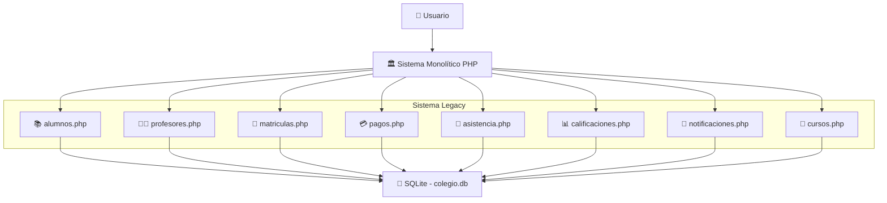
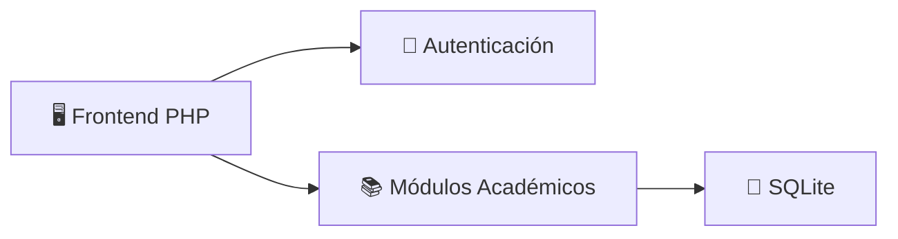
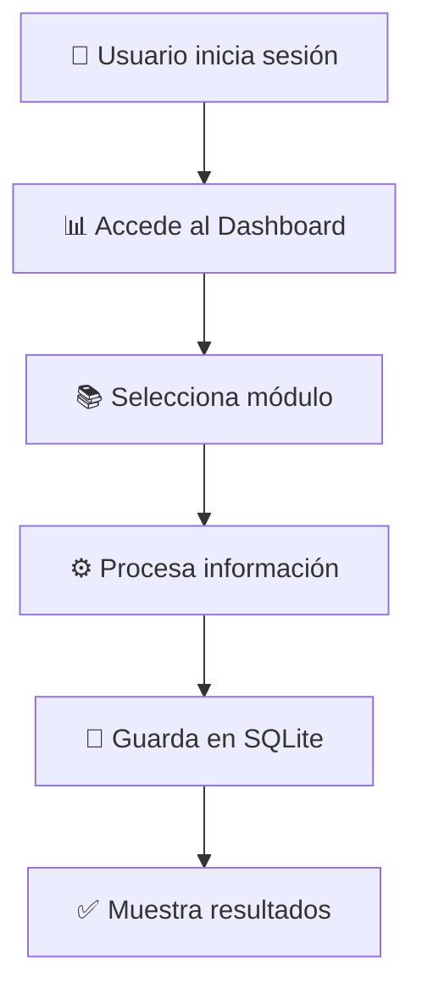
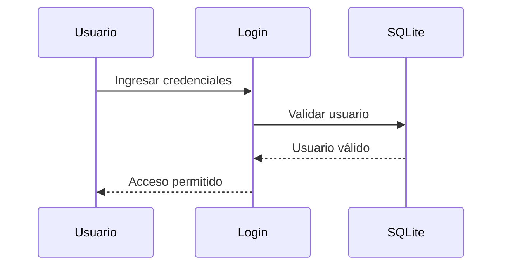
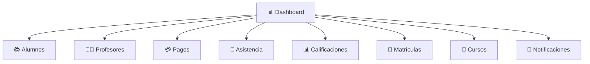
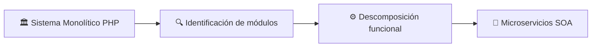
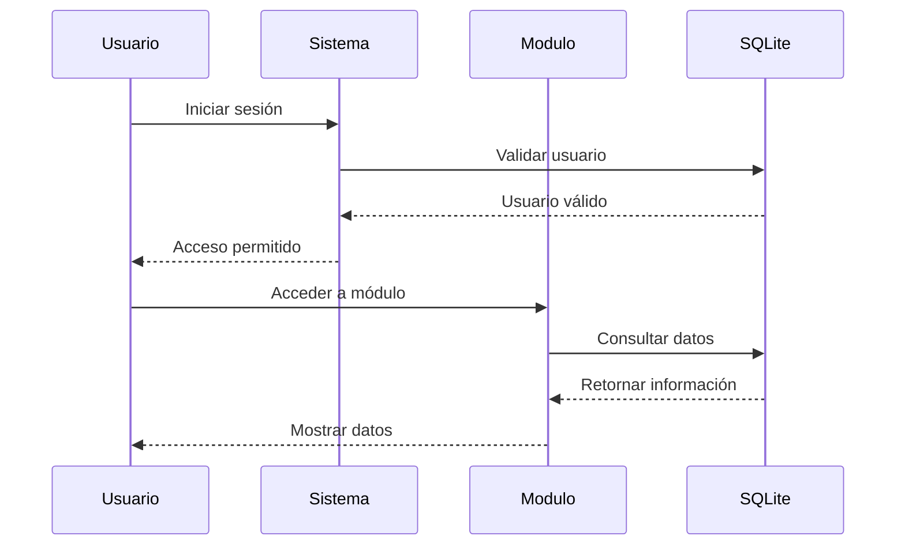

# 🎓 Sistema Legacy - Colegio Futuro Digital

Sistema de gestión académica monolítico desarrollado con **PHP, SQLite, HTML, CSS y JavaScript**.  
Este proyecto representa la versión **legacy tradicional** del sistema académico del Colegio Futuro Digital, utilizada como base inicial antes de la migración hacia una arquitectura SOA basada en microservicios.

---

# 📋 Contenido de esta Documentación

- ¿Qué es una Arquitectura Monolítica?
- Características del Sistema Legacy
- Arquitectura del Sistema
- Diagramas del Sistema
- Modelo de Datos
- Módulos del Sistema
- Estructura del Proyecto
- Autenticación y Seguridad
- Roles del Sistema
- Flujo General del Sistema
- Tecnologías Utilizadas
- Instalación y Ejecución
- Problemas del Sistema Legacy
- Relación con la Migración SOA

---

# 💡 ¿Qué es una Arquitectura Monolítica?

Una arquitectura monolítica es un modelo tradicional de desarrollo de software donde todas las funcionalidades del sistema se encuentran integradas dentro de una sola aplicación centralizada.

En este enfoque:

- Toda la lógica del negocio comparte el mismo proyecto.
- Todos los módulos utilizan la misma base de datos.
- El sistema se despliega como una sola aplicación.
- Existe fuerte dependencia entre componentes.

---

# 🏛️ Características del Sistema Legacy

Este sistema fue desarrollado como una solución académica tradicional para gestionar procesos administrativos y académicos del colegio.

| Característica | Implementación |
|---|---|
| Arquitectura | Monolítica |
| Backend | PHP |
| Base de Datos | SQLite |
| Frontend | HTML + CSS + JavaScript |
| Autenticación | Sesiones PHP |
| Comunicación interna | Directa entre módulos |
| Base de datos | Compartida y centralizada |

---

# 🏗️ Arquitectura del Sistema

La arquitectura del sistema se encuentra organizada como una aplicación monolítica centralizada.

Todos los módulos académicos y administrativos funcionan dentro del mismo entorno PHP y comparten una única base de datos SQLite.



---

# 📊 Diagramas del Sistema

## 🔹 Diagrama de Componentes



---

## 🔹 Diagrama de Flujo Académico



---

## 🔹 Diagrama de Autenticación



---

## 🔹 Diagrama de Módulos del Sistema



---

## 🔹 Transformación Legacy → SOA



---

# 📊 Modelo de Datos

El sistema utiliza una base de datos SQLite centralizada que almacena toda la información académica y administrativa.

## Principales entidades

- usuarios
- alumnos
- profesores
- cursos
- matriculas
- pagos
- asistencias
- calificaciones
- notificaciones

---

# 🧩 Módulos del Sistema

| Módulo | Funcionalidad |
|---|---|
| alumnos.php | Gestión de estudiantes |
| profesores.php | Gestión de docentes |
| cursos.php | Administración académica |
| matriculas.php | Registro de matrículas |
| pagos.php | Gestión financiera |
| asistencia.php | Control de asistencia |
| calificaciones.php | Registro de notas |
| notificaciones.php | Alertas y mensajes |

---

# 📂 Estructura del Proyecto

```bash
SISTEMALEGACY/
│
├── assets/
│   ├── css/
│   └── js/
│
├── config/
│   └── db.php
│
├── database/
│   ├── colegio.db
│   ├── colegio.db.bak
│   └── reset_db.php
│
├── includes/
│   ├── auth.php
│   ├── header.php
│   ├── footer.php
│   └── sidebar.php
│
├── modules/
│   ├── alumnos.php
│   ├── asistencia.php
│   ├── calificaciones.php
│   ├── cursos.php
│   ├── matriculas.php
│   ├── notificaciones.php
│   ├── pagos.php
│   └── profesores.php
│
├── dashboard.php
├── index.php
├── login.php
├── logout.php
└── README.md
```

---

# 🔐 Autenticación y Seguridad

El sistema implementa autenticación tradicional utilizando sesiones PHP.

## Características implementadas

- Inicio de sesión mediante `login.php`
- Validación de usuarios
- Manejo de sesiones PHP
- Restricción de acceso por rol
- Protección de módulos internos

---

# 👥 Roles del Sistema

| Rol | Funcionalidad |
|---|---|
| Director | Acceso total al sistema |
| Administrador | Gestión académica y administrativa |
| Docente | Registro de asistencia y calificaciones |
| Alumno | Consulta de información académica |
| Padre de familia | Consulta de pagos y notas |

---

# 📈 Dashboard del Sistema

El sistema incluye un dashboard administrativo con:

- Estadísticas académicas
- Resumen financiero
- Gestión de matrículas
- Visualización de alumnos
- Control de pagos
- Acceso rápido a módulos

---

# 🔄 Flujo General del Sistema



---

# ⚙️ Tecnologías Utilizadas

| Tecnología | Uso |
|---|---|
| PHP | Backend monolítico |
| SQLite | Base de datos |
| HTML5 | Estructura frontend |
| CSS3 | Estilos |
| JavaScript | Funcionalidades cliente |
| Bootstrap | Diseño responsive |
| PDO | Conexión segura a SQLite |

---

# ▶️ Instalación y Ejecución

## 📌 Requisitos

- PHP 8 o superior
- SQLite
- Navegador moderno

---

## 🚀 Ejecutar Proyecto

Desde la raíz del proyecto:

```bash
php -S localhost:8000
```

Abrir en navegador:

```txt
http://localhost:8000
```

---

# 👤 Usuarios de Prueba

| Usuario | Rol |
|---|---|
| director@colegio.com | Director |
| admin@colegio.com | Administrador |
| docente@colegio.com | Docente |
| alumno@colegio.com | Alumno |

### Contraseña

```txt
password123
```

---

# ⚠️ Problemas del Sistema Legacy

Durante el análisis del sistema monolítico se identificaron diversas limitaciones técnicas.

## 🔴 Alto Acoplamiento

Todos los módulos dependen directamente entre sí.

## 🔴 Escalabilidad Limitada

El crecimiento del sistema afecta el rendimiento general.

## 🔴 Mantenimiento Complejo

Cambios en un módulo pueden afectar otros componentes.

## 🔴 Integración Limitada

Dificultad para conectarse con servicios externos modernos.

## 🔴 Dependencia Centralizada

Toda la lógica y datos se encuentran dentro de una sola aplicación.

---

# 🚀 Relación con la Migración SOA

Este sistema legacy fue utilizado como base para la migración hacia una Arquitectura Orientada a Servicios (SOA).

A partir de este sistema monolítico se identificaron los módulos candidatos a microservicios.

| Sistema Legacy | Sistema SOA |
|---|---|
| alumnos.php | alumnos-service |
| asistencia.php | asistencia-service |
| pagos.php | pagos-service |
| matriculas.php | matricula-service |
| profesores.php | profesores-service |
| calificaciones.php | calificaciones-service |
| notificaciones.php | notificaciones-service |
| cursos.php | cursos-service |

La nueva arquitectura SOA permitió desacoplar los procesos académicos y administrativos en servicios independientes capaces de comunicarse mediante APIs REST.

---

# 🏛️ Proyecto Académico

## 🎓 Colegio Futuro Digital

Arquitectura Orientada a Servicios (SOA)  
Universidad Tecnológica del Perú

---

Sistema legacy utilizado como base para la transformación hacia arquitectura SOA.